<p align="center">
  
</p>

<p align="center">
  <a href="LICENSE.md"></a>
  
  
  
</p>

<h3 align="center">Works with Claude Code today &nbsp;·&nbsp; Codex and Antigravity — coming soon</h3>

Your agent is a genius with amnesia. Every session it meets your codebase for the first time and pretends otherwise. basemode gives it one memory that actually knows what things are — your code structure, your projects, your decisions, your rules, what it all means and how it connects — and puts the right slice of it in front of the model the second it's needed. No prompt to paste. No document to maintain. Same agent, briefed.

This repo is the basemode engine: one Rust binary, `base`, that maps your workspace into a knowledge graph and wires it into Claude Code's hook pipeline.

<p align="center">
  
</p>

## The same question, twice

Ask an un-briefed agent where a function is used and it greps. Twelve files later it has a guess, delivered in complete sentences with excellent grammar. Ask an agent running on basemode and the answer was already in front of it before it started looking — the graph mapped every function, caller, and import ahead of time, and the hook placed the relevant slice into the turn.

The difference isn't the model. It's whether anything put the answer in front of it before it started guessing.

## One agent turn, four places context can land

basemode wires into every hook Claude Code exposes. Each injection is a query against the moment — opening an auth file returns the auth rules, the decision that governs them, and nothing else. Targeted, never a dump.

| Moment | What lands |
|---|---|
| **Session start** | Everything standing that governs where the agent is about to work — active projects, open handoffs, stale files, signals |
| **At the prompt** | Whatever bears on the thing just asked for — matching domain rules, prior decisions, notes |
| **Before a tool runs** | The shape of the file about to be touched — its entities, imports, and dependents — placed before it gets read |
| **After it returns** | What the result means here — the call chain for the exact lines just read, while it still matters |

Every agent inherits this. Main session, subagents, explore agents — same hooks, same graph, same briefing.

## Quick start

```bash
# build
cargo build --release

# install (copies binary, creates config, wires hooks)
./target/release/base install

# scaffold your workspace
cd ~/my-workspace
base scaffold
```

Three commands. `base install` puts the binary in `~/.local/bin/base`, writes global config to `~/.base-gbl/`, and wires the hooks into `~/.claude/settings.json`. It also offers the starter star commands — `*handoff`, `*fork`, `*base`, `*end` — so a fresh install has something to type on day one (`--starter-commands` / `--no-starter-commands` to answer without the prompt). `base scaffold` creates `.base/` in your workspace.

<details>
<summary><strong>Windows</strong></summary>

Grab the prebuilt `base-windows-x86_64.zip` from the [latest release](../../releases) — no toolchain needed.

To build from source instead, run the helper from a normal PowerShell window:

```powershell
powershell -ExecutionPolicy Bypass -File scripts\build-base-windows.ps1
```

It imports the MSVC developer environment, resolves LLVM/libclang (bindgen needs it for the vendored RocksDB), and runs `cargo install`. AST extraction resolves the Python interpreter automatically on install.

</details>

### Staying current

base keeps itself up to date. Session start checks for a new release and, when there is one, installs it in a detached background process — no download in your way, no output, nothing to run. The swap is an atomic rename, so the session you are in keeps the binary it started with and the next one comes up new.

```bash
base config set update.auto false   # pin this machine instead
base update                         # or drive it by hand any time
```

## See it work in five minutes

```bash
# 1. register a project
base p a -n "My App" -p "src"

# 2. map the codebase — tree-sitter across 35+ languages
base sync --ast --target src

# 3. ask the graph instead of grepping
base a q -c "auth"              # find any entity named "auth"
base a q --calls "validate"     # who calls this function?
base a q -f "main.rs"           # what's in this file?

# 4. teach it one rule
base rule add --domain myapp --text "Migrations always run through the CLI, never raw SQL"
```

Then open Claude Code and touch a mapped file. The file's shape arrives in the turn before its content does. Type a prompt that matches the domain and the rule arrives with it. That loop — teach the graph, watch it come back on its own — is the whole product.

## What the graph knows

**Your code.** Every function, struct, class, import, and call relationship, extracted by tree-sitter and queryable through SPARQL. "What calls this?" is a graph query, not a grep.

**Your business.** Projects with milestones and tasks. Decisions and the rationale behind them. Domain rules that fire when the context matches. The stuff that otherwise lives in your head or in a wiki that was last accurate in March.

**Your documents.** Markdown with frontmatter becomes connected graph nodes — headings, links, `[[wikilinks]]`, tags, all edges. When an agent writes markdown, the hook teaches it the extraction contract at the moment of writing, so docs are born graph-aware.

**Your operations.** Which domains are active, what changed since last session, what's stale, what's open. Signals that orient the agent before you type a word.

All of it relational, all of it in plain-text NQuads files that live in your repo and diff in git.

## Sessions that survive

The graph remembers between sessions — and between agents.

```bash
*handoff   # end a session so the next one resumes where you left off
*fork      # park side-work that came up, without derailing what you're doing
*base      # sweep this session's decisions, tasks, and learnings into the graph
*end       # all three at once, to close out cleanly
```

These are star commands — typed straight into the chat, defined in `commands.toml`, fully customizable (`base commands list` shows what's loaded). Open handoffs resurface automatically at the next session start.

Multiple live sessions coordinate through the relay: `base relay` gives titled sessions, instant pings, briefed task hand-offs that fire inside the receiving session's hooks, and an operator board of who's alive and what's pending.

## Ask it things

```bash
base recall --keyword "auth"                  # search everything remembered
base decision search --keyword "database"     # find prior decisions with rationale
base context "touching the billing module"    # preview exactly what would inject

# GraphRAG over your documents
base graph extract --target docs/             # LLM pass: markdown -> concepts + edges
base graph query "why did we drop Vercel?"    # retrieve + synthesize from the graph
base graph analyze                            # god nodes, communities, bridges
```

And `base dashboard` opens the Command Center — the embedded web UI over the same graph.

<details>
<summary><strong>Full command surface</strong></summary>

```bash
# projects / milestones / tasks
base project add -n "..." -p "src/x"       base p l
base milestone add -p <project> -n "..."   base task add -p <project> -n "..."
base task done <slug>

# memory
base learn --text "..." --domain X --type insight|correction|decision
base decision log --domain X --decision "..." --rationale "..."
base rule add --domain X --text "..."

# code graph
base ast query -c "<name>" | -f "<file>" | --calls "<fn>" | -i "<file>"
base ast query -t apps/X -c "<name>"       # another app's map, no cd
base sync --ast --target apps/X

# sessions
base handoff create|list|archive|snooze    base fork create|list|archive
base relay register|send|ping|task|board|wait

# health
base doctor                                # graph health across tiers; fail-open by design
```

Every command has a short alias (`base p a`, `base a q`, `base d log`). `base help <sub>` for the rest.

</details>

## How this compares

**A CLAUDE.md** is a static document you wrote once. It doesn't know what you're touching right now, doesn't adapt, and doesn't suppress itself when irrelevant. basemode queries the moment.

**LSP** answers "where is this symbol" for one language at a time, with no project context and no memory. basemode holds code, projects, and decisions in one graph, across 35+ languages, and volunteers what's relevant.

**Vector-store memory** is a heap of passages with similarity search bolted on — you get the closest-looking paragraph. basemode stores what things *mean* and what they *connect to*: the decision, its rationale, the files it governs, the tasks it spawned.

**Persistence is table stakes. Delivery is the product.** A memory nobody opens is a filing cabinet with extra steps — an agent can't go looking for something it doesn't know exists. basemode speaks first.

## A graph in a folder is not a memory

There's a category of tool that points at your repo and hands you a knowledge graph in an output folder. The graph is real, the pictures are impressive, and the demo is convincing — right up until you keep working. It's a batch artifact: stale by your next commit, re-built by hand, and it knows your files while knowing nothing about your projects, your decisions, your rules, or the session you're in the middle of.

Worse, it only answers when asked. An agent mid-task doesn't stop to interrogate a side database — it doesn't know what's in there, so it doesn't go looking. It guesses instead, in complete sentences. A memory that waits for a query is a filing cabinet with extra steps, and the cabinet is in another room.

basemode is built on the opposite bet:

| | Graph-in-a-folder | basemode |
|---|---|---|
| **Freshness** | Batch export, re-run by hand, stale at the next commit | Maintains itself — hooks re-sync the graph as you work |
| **What it knows** | Files and extracted concepts | Code structure *and* projects, decisions with rationale, rules, sessions |
| **Delivery** | Answers when you remember to ask | Speaks first — four injection points inside the agent's own turn |
| **Precision** | The subgraph you asked for | The slice the moment calls for — this file's shape, this domain's rules, nothing else |
| **Scope** | One repo at a time | Every workspace on the machine, one graph, inherited by every agent |
| **Sessions** | No concept of one | Handoffs, forks, and a relay between live sessions |

The graph was never the product. The graph is plumbing. The product is the right fact arriving in the turn before the model starts guessing — automatically, every time, without anyone asking.

## Stack

| Layer | Tech |
|-------|------|
| Language | Rust (single binary, ~20MB — includes embedded dashboard SPA) |
| Graph | Oxigraph (embedded, in-memory, loaded from disk per invocation) |
| Query | SPARQL SELECT and UPDATE |
| Persistence | NQuads text files (git-native, atomic write-back, validated before commit) |
| Config | TOML (domains.toml, base.toml, commands.toml) |
| AST extraction | Tree-sitter (35+ languages) |
| Hooks | Claude Code settings.json (stdin/stdout JSON, fail-open) |

Going deeper: [hook configuration](docs/settings-hook-config.md) · [workspace scoping](docs/workspace-scoping.md) · [extensions](docs/extensions.md) · [command plugins](docs/command-plugins.md) · [graph durability](docs/graph-durability.md) · [markdown ontology](docs/markdown-ontology-protocol.md)

## License

basemode is source-available under the [PolyForm Noncommercial License 1.0.0](LICENSE.md). You can use it, study it, and modify it for any noncommercial purpose. Commercial use — including reselling, repackaging, or building it into a product — requires a separate commercial license granted individually, with approval and terms. Reach out via [chrisai.cv](https://chrisai.cv).

---

Built by Chris Kahler
[Chris AI Systems](https://chrisai.cv) / [Community](https://www.skool.com/claude-code-titans-9203) / [YouTube](https://www.youtube.com/@chris-ai-systems)
